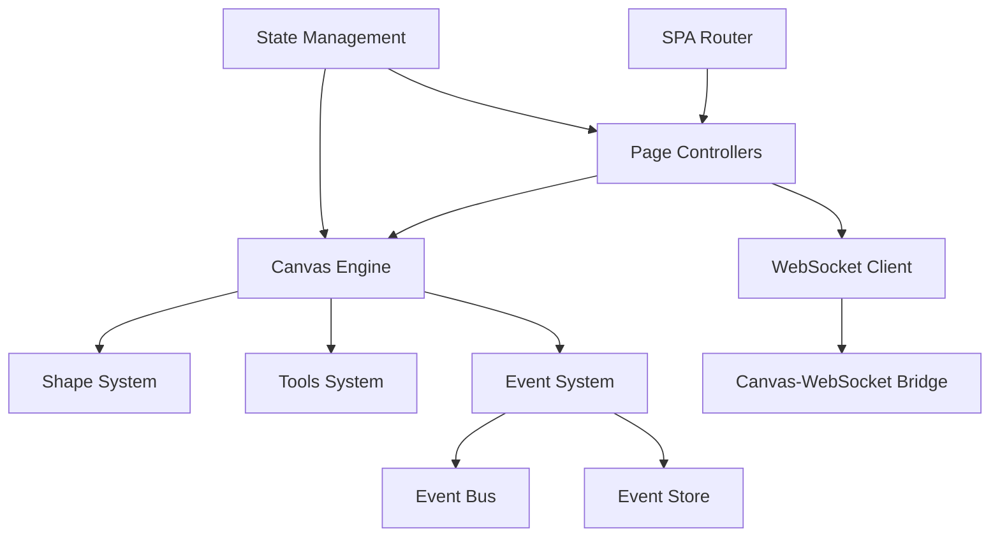

# Frontend Components Dokumentation

## Component Übersicht

Das Frontend folgt einem komponentenbasierten Ansatz, wobei jede Komponente spezifische UI-Funktionalitäten kapselt und eine klare Schnittstelle für die Kommunikation bereitstellt.

## 1. SPA Router Component (app.js)

### Zweck
Zentrale Navigation und Routing-Logik für die Single Page Application.

### Kernfunktionalitäten
- **Template-basiertes Routing**: Dynamisches Laden von HTML-Templates
- **Script Injection**: Automatisches Laden von page-spezifischen JavaScript-Dateien
- **Authentication Guards**: Route-Schutz für authentifizierungspflichtige Seiten
- **History Management**: Browser-History API Integration

### Wichtige Funktionen
```javascript
// Template Loading mit Caching
async function loadTemplate(templateName) {
    if (templateCache[templateName]) {
        return templateCache[templateName];
    }
    // Fetch und Cache Template
}

// Navigation mit Authentication Check
async function navigateToPage(pageName, params = {}) {
    const pageConfig = pages[pageName];
    if (pageConfig.requiresAuth && !await isAuthenticated()) {
        return navigateToPage('login');
    }
    // Load Template und Scripts
}
```

### Page Configuration Schema
```javascript
const pageConfig = {
    title: string,           // Browser-Titel
    template: string,        // HTML Template-Datei
    defaultPath: string,     // URL-Pattern
    scripts: string[],       // JavaScript-Abhängigkeiten
    styles: string[],        // CSS-Abhängigkeiten
    requiresAuth: boolean    // Authentifizierung erforderlich
};
```

## 2. Canvas Engine Components

### 2.1 Canvas Controller (canvas.ts)

#### Zweck
Zentrale Verwaltung des HTML5 Canvas-Elements und Koordination aller Zeichenoperationen.

#### Kernfunktionalitäten
- **Canvas Initialization**: Setup von Canvas-Kontext und Event-Listeners
- **Coordinate System**: Transformation zwischen Screen- und Canvas-Koordinaten  
- **Rendering Pipeline**: Koordination des Shape-Rendering-Prozesses
- **Event Delegation**: Weiterleitung von Mouse/Touch-Events an Tools

#### Wichtige Klassen
```typescript
export class Canvas {
    private context: CanvasRenderingContext2D;
    private shapes: Shape[] = [];
    private currentTool: Tool | null = null;
    
    constructor(canvasElement: HTMLCanvasElement) {
        this.context = canvasElement.getContext('2d')!;
        this.setupEventListeners();
    }
    
    public render(): void {
        this.clearCanvas();
        this.shapes.forEach(shape => shape.draw(this.context));
    }
    
    public addShape(shape: Shape): void {
        this.shapes.push(shape);
        this.render();
    }
}
```

### 2.2 Shape System Components

#### Abstract Shape Base Class (abstract-shapes.ts)
```typescript
export abstract class AbstractShape implements Shape {
    protected id: string;
    protected position: Point2D;
    protected color: string;
    protected strokeWidth: number;
    
    abstract draw(context: CanvasRenderingContext2D): void;
    abstract getBounds(): Rectangle;
    abstract isPointInside(point: Point2D): boolean;
    
    public getId(): string { return this.id; }
    public getPosition(): Point2D { return this.position; }
}
```

#### Concrete Shape Implementations

##### Line Component (shapes/line.ts)
- **Eigenschaften**: Start/End-Punkt, Strichstärke, Farbe
- **Rendering**: Lineare Interpolation zwischen Punkten
- **Hit Testing**: Punkt-zu-Linie Distanz-Berechnung
- **Bounding Box**: Rechteck um Linie

##### Circle Component (shapes/circle.ts)  
- **Eigenschaften**: Mittelpunkt, Radius, Füllfarbe, Randfarbe
- **Rendering**: Canvas arc() API
- **Hit Testing**: Punkt-zu-Mittelpunkt Distanz-Vergleich
- **Bounding Box**: Quadrat um Kreis

##### Rectangle Component (shapes/rectangle.ts)
- **Eigenschaften**: Position, Breite, Höhe, Rotation
- **Rendering**: Rechteck mit optionaler Rotation
- **Hit Testing**: Punkt-in-Rechteck mit Rotations-Transformation
- **Bounding Box**: Rotiertes Rechteck

##### Triangle Component (shapes/triangle.ts)
- **Eigenschaften**: Drei Eckpunkte, Füllfarbe
- **Rendering**: Canvas-Pfad mit drei Linien
- **Hit Testing**: Barycentric Coordinate System
- **Bounding Box**: Minimum/Maximum der Eckpunkte

### 2.3 Factory Pattern Components (shape-factory.ts)

#### Zweck
Zentralisierte Shape-Erstellung mit einheitlicher Schnittstelle.

```typescript
export class ShapeFactory {
    public static createLine(start: Point2D, end: Point2D, options?: LineOptions): Line {
        return new Line(start, end, options);
    }
    
    public static createCircle(center: Point2D, radius: number, options?: CircleOptions): Circle {
        return new Circle(center, radius, options);
    }
    
    public static createFromData(data: ShapeData): Shape {
        switch (data.type) {
            case 'line': return this.createLine(data.start, data.end, data.options);
            case 'circle': return this.createCircle(data.center, data.radius, data.options);
            default: throw new Error(`Unknown shape type: ${data.type}`);
        }
    }
}
```

### 2.4 Tools System Components (tools.ts)

#### Selection Tool
- **Funktionalität**: Shape-Auswahl und -Manipulation
- **Interaction**: Click-to-Select, Drag-to-Move
- **Visual Feedback**: Selection Handles, Bounding Box
- **Single Selection**: Shape-Auswahl durch Click

#### Drawing Tools
```typescript
export abstract class DrawingTool {
    abstract onMouseDown(point: Point2D): void;
    abstract onMouseMove(point: Point2D): void;
    abstract onMouseUp(point: Point2D): void;
    abstract getCursor(): string;
}

export class LineTool extends DrawingTool {
    private startPoint: Point2D | null = null;
    private previewLine: Line | null = null;
    
    onMouseDown(point: Point2D): void {
        this.startPoint = point;
    }
    
    onMouseMove(point: Point2D): void {
        if (this.startPoint) {
            this.previewLine = new Line(this.startPoint, point);
            this.canvas.renderPreview(this.previewLine);
        }
    }
    
    onMouseUp(point: Point2D): void {
        if (this.startPoint) {
            const line = new Line(this.startPoint, point);
            this.canvas.addShape(line);
            this.startPoint = null;
            this.previewLine = null;
        }
    }
}
```

#### Enhanced Selection Tool mit Remote Selection Support
```typescript
export class SelectionTool implements ShapeFactory {
    private selectedShapes: Set<number> = new Set();
    private shapesAtClickPoint: number[] = [];
    
    handleNormalSelection(isCtrlPressed: boolean): void {
        if (!isCtrlPressed) {
            this.clearSelection();
        }
        
        if (this.shapesAtClickPoint.length > 0) {
            const shapeToSelect = this.shapesAtClickPoint[0];
            
            // Remote Selection Blocking
            const remoteSelections = (window as any)._remoteSelections;
            if (remoteSelections && remoteSelections.has(shapeToSelect)) {
                const remoteSelection = remoteSelections.get(shapeToSelect);
                console.log(`Shape ${shapeToSelect} is locked by ${remoteSelection.clientId}`);
                return; // Block selection
            }
            
            this.selectedShapes.add(shapeToSelect);
            this.publishSelectionEvent(shapeToSelect, 'selected');
        }
    }
    
    // Alt-Click Cycling durch überlappende Shapes
    handleAltSelection(): void {
        if (this.shapesAtClickPoint.length === 0) return;
        
        this.clearSelection();
        this.cycleToNextShape();
    }
    
    // Drag & Drop Implementation
    private prepareDragOperation(x: number, y: number): void {
        this.isDragging = true;
        this.shapesBeingDragged.clear();
        
        // Drag-Flag für Event-Suppression
        (window as any)._isDragging = true;
        
        this.selectedShapes.forEach(shapeId => {
            if (shapes[shapeId]) {
                this.shapesBeingDragged.set(shapeId, shapes[shapeId]);
            }
        });
    }
    
    private completeDragOperation(x: number, y: number): void {
        const deltaX = x - this.dragStartPoint.x;
        const deltaY = y - this.dragStartPoint.y;
        
        if (Math.abs(deltaX) > 2 || Math.abs(deltaY) > 2) {
            // A4-Style: Create new shapes with new IDs
            this.shapesBeingDragged.forEach((originalShape, oldShapeId) => {
                // Send DELETE for original
                window.eventBus.publish({
                    type: 'SHAPE_DELETED',
                    shapeId: oldShapeId
                });
                
                // Create moved shape with new ID
                const movedShape = this.createMovedShape(originalShape, deltaX, deltaY);
                this.canvas.addShape(movedShape, false);
            });
        }
        
        (window as any)._isDragging = false;
    }
}
```

## 3. Event System Components

### 3.1 Event Bus Component (event-bus.ts)

#### Zweck
Publish/Subscribe-Pattern für lose gekoppelte Komponent-Kommunikation.

```typescript
export class EventBus {
    private listeners: Map<string, Function[]> = new Map();
    
    public subscribe<T>(eventType: string, callback: (data: T) => void): void {
        if (!this.listeners.has(eventType)) {
            this.listeners.set(eventType, []);
        }
        this.listeners.get(eventType)!.push(callback);
    }
    
    public publish<T>(eventType: string, data: T): void {
        const callbacks = this.listeners.get(eventType);
        if (callbacks) {
            callbacks.forEach(callback => {
                try {
                    callback(data);
                } catch (error) {
                    console.error(`Error in event callback for ${eventType}:`, error);
                }
            });
        }
    }
}
```

#### Event Types
- **Canvas Events**: `shape.created`, `shape.modified`, `shape.deleted`
- **Tool Events**: `tool.changed`, `tool.activated`
- **UI Events**: `color.changed`, `strokeWidth.changed`
- **Network Events**: `websocket.connected`, `websocket.disconnected`

### 3.2 Event Store Component (event-store.ts)

#### Zweck
Lokale Speicherung und Verwaltung von Canvas-Events.

```typescript
export class EventStore {
    private events: CanvasEvent[] = [];
    
    public addEvent(event: CanvasEvent): void {
        this.events.push(event);
    }
    
    public getEvents(): CanvasEvent[] {
        return this.events;
    }
}
```

### 3.3 Event Wrapper Component (event-wrapper.ts)

#### Zweck
Normalisierung und Anreicherung von Events für konsistente Verarbeitung.

```typescript
export class EventWrapper {
    public static wrapCanvasEvent(type: string, data: any, canvas_id: string): CanvasEvent {
        return {
            id: generateEventId(),
            type: type,
            canvas_id: canvas_id,
            user_id: getCurrentUserId(),
            data: data,
            timestamp: new Date().toISOString(),
            metadata: {
                client_version: getClientVersion(),
                user_agent: navigator.userAgent
            }
        };
    }
    
    public static unwrapCanvasEvent(event: CanvasEvent): ProcessedEvent {
        return {
            type: event.type,
            data: event.data,
            isLocal: event.user_id === getCurrentUserId(),
            timestamp: new Date(event.timestamp),
            metadata: event.metadata
        };
    }
}
```

## 4. WebSocket Communication Components

### 4.1 WebSocket Client (websocket-client.js)

#### Zweck
Robuste WebSocket-Verbindung mit automatischer Wiederherstellung.

```javascript
class WebSocketClient {
    constructor(url) {
        this.url = url;
        this.socket = null;
        this.reconnectAttempts = 0;
        this.maxReconnectAttempts = 5;
        this.reconnectDelay = 1000;
        this.messageQueue = [];
    }
    
    connect() {
        this.socket = new WebSocket(this.url);
        
        this.socket.onopen = () => {
            console.log('WebSocket connected');
            this.reconnectAttempts = 0;
            this.flushMessageQueue();
        };
        
        this.socket.onclose = () => {
            console.log('WebSocket disconnected');
            this.attemptReconnect();
        };
        
        this.socket.onerror = (error) => {
            console.error('WebSocket error:', error);
        };
        
        this.socket.onmessage = (event) => {
            this.handleMessage(JSON.parse(event.data));
        };
    }
    
    send(message) {
        if (this.isConnected()) {
            this.socket.send(JSON.stringify(message));
        } else {
            this.messageQueue.push(message);
        }
    }
    
    attemptReconnect() {
        if (this.reconnectAttempts < this.maxReconnectAttempts) {
            setTimeout(() => {
                this.reconnectAttempts++;
                this.connect();
            }, this.reconnectDelay * Math.pow(2, this.reconnectAttempts));
        }
    }
}
```

### 4.2 Canvas-WebSocket Bridge (canvas-websocket-bridge.js)

#### Zweck
Integration zwischen Canvas-Events und WebSocket-Messages.

```javascript
class CanvasWebSocketBridge {
    constructor(canvas, webSocketClient) {
        this.canvas = canvas;
        this.webSocketClient = webSocketClient;
        this.setupEventListeners();
    }
    
    setupEventListeners() {
        // Canvas Events -> WebSocket Messages
        this.canvas.on('shape.created', (event) => {
            const message = {
                type: 'canvas_event',
                event_type: 'shape_created',
                canvas_id: this.canvas.getId(),
                data: event.shape
            };
            this.webSocketClient.send(message);
        });
        
        // WebSocket Messages -> Canvas Events
        this.webSocketClient.on('message', (message) => {
            if (message.type === 'canvas_event') {
                this.handleRemoteCanvasEvent(message);
            }
        });
    }
    
    handleRemoteCanvasEvent(message) {
        // Prevent echo (don't process own events)
        if (message.user_id === getCurrentUserId()) {
            return;
        }
        
        switch (message.event_type) {
            case 'shape_created':
                this.canvas.addShapeFromRemote(message.data);
                break;
            case 'shape_modified':
                this.canvas.updateShapeFromRemote(message.data);
                break;
            case 'shape_deleted':
                this.canvas.deleteShapeFromRemote(message.data.shape_id);
                break;
        }
    }
}
```

## 5. State Management Components

### 5.1 Color State Component (color-state.js)

#### Zweck
Zentrale Verwaltung von Farb-Zuständen und Farbauswahl-UI.

```javascript
class ColorState {
    constructor() {
        this.currentColor = '#000000';
        this.eventBus = new EventBus();
    }
    
    setCurrentColor(color) {
        if (this.isValidColor(color)) {
            this.currentColor = color;
            this.eventBus.publish('color.changed', { color });
        }
    }
    
    getCurrentColor() {
        return this.currentColor;
    }
    
    isValidColor(color) {
        return /^#[0-9A-F]{6}$/i.test(color);
    }
}
```

### 5.2 Drawer State Component (drawer-state.js)

#### Zweck
Zentraler Zustand für Canvas-Zeichenfunktionalität.

```javascript
class DrawerState {
    constructor() {
        this.currentTool = 'select';
        this.selectedShapes = new Set();
        this.drawingMode = true;
        this.strokeWidth = 2;
        this.fillColor = 'transparent';
        this.eventBus = new EventBus();
    }
    
    setCurrentTool(toolName) {
        if (this.isValidTool(toolName)) {
            this.currentTool = toolName;
            this.eventBus.publish('tool.changed', { tool: toolName });
        }
    }
    
    selectShape(shapeId) {
        this.selectedShapes.add(shapeId);
        this.eventBus.publish('shape.selected', { shapeId });
    }
    
    deselectShape(shapeId) {
        this.selectedShapes.delete(shapeId);
        this.eventBus.publish('shape.deselected', { shapeId });
    }
    
    clearSelection() {
        const previousSelection = Array.from(this.selectedShapes);
        this.selectedShapes.clear();
        this.eventBus.publish('selection.cleared', { previousSelection });
    }
}
```

## 6. Page Controller Components

### 6.1 Drawer Page Controller (drawer_page.js)

#### Zweck
Koordination aller Komponenten für die Hauptzeichenseite.

```javascript
class DrawerPageController {
    constructor() {
        this.canvas = null;
        this.webSocketClient = null;
        this.bridge = null;
        this.colorState = new ColorState();
        this.drawerState = new DrawerState();
    }
    
    async initialize() {
        await this.initializeCanvas();
        this.initializeWebSocket();
        this.initializeBridge();
        this.setupUIBindings();
    }
    
    async initializeCanvas() {
        const canvasElement = document.getElementById('drawArea');
        this.canvas = new Canvas(canvasElement);
        
        // Initialize drawer system
        if (typeof window.drawer !== 'undefined') {
            window.drawer.init();
        }
    }
    
    initializeWebSocket() {
        const canvasId = this.getCanvasIdFromURL();
        const wsUrl = `ws://localhost:3000/channel?canvas_id=${canvasId}`;
        this.webSocketClient = new WebSocketClient(wsUrl);
        this.webSocketClient.connect();
    }
    
    initializeBridge() {
        this.bridge = new CanvasWebSocketBridge(this.canvas, this.webSocketClient);
    }
    
    setupUIBindings() {
        // Tool selection buttons
        document.querySelectorAll('.tool-button').forEach(button => {
            button.addEventListener('click', (e) => {
                const toolName = e.target.dataset.tool;
                this.drawerState.setCurrentTool(toolName);
            });
        });
        
        // Color picker
        const colorPicker = document.getElementById('colorPicker');
        colorPicker.addEventListener('change', (e) => {
            this.colorState.setCurrentColor(e.target.value);
        });
    }
}
```

### 6.2 Menu API Controller (menu-api.js)

#### Zweck
Interface für Canvas-Verwaltung und API-Kommunikation.

```javascript
class MenuAPIController {
    constructor() {
        this.apiBaseUrl = '/api';
    }
    
    async loadCanvasList() {
        try {
            const response = await fetch(`${this.apiBaseUrl}/canvas`);
            if (!response.ok) throw new Error(`HTTP ${response.status}`);
            
            const data = await response.json();
            this.renderCanvasList(data.canvas);
        } catch (error) {
            console.error('Failed to load canvas list:', error);
            this.showError('Fehler beim Laden der Canvas-Liste');
        }
    }
    
    async createCanvas(name) {
        try {
            const response = await fetch(`${this.apiBaseUrl}/canvas`, {
                method: 'POST',
                headers: { 'Content-Type': 'application/json' },
                body: JSON.stringify({ name })
            });
            
            if (!response.ok) throw new Error(`HTTP ${response.status}`);
            
            const data = await response.json();
            this.showSuccess('Canvas erfolgreich erstellt');
            this.loadCanvasList(); // Refresh list
        } catch (error) {
            console.error('Failed to create canvas:', error);
            this.showError('Fehler beim Erstellen der Canvas');
        }
    }
    
    renderCanvasList(canvasList) {
        const container = document.getElementById('canvasListContainer');
        container.innerHTML = canvasList.map(canvas => `
            <div class="canvas-item" data-canvas-id="${canvas.id}">
                <h3>${canvas.name}</h3>
                <p>Berechtigung: ${canvas.your_permission}</p>
                <button onclick="openCanvas('${canvas.id}')">Öffnen</button>
            </div>
        `).join('');
    }
}
```

## Component Dependencies

### Dependency Graph


### Component Lifecycle
1. **Application Bootstrap**: SPA Router initialisiert
2. **Page Navigation**: Router lädt Template und Scripts
3. **Component Initialization**: Page Controller startet Komponenten
4. **Event System Setup**: Event Bus und Store initialisiert
5. **Canvas Initialization**: Canvas Engine und Tools setup
6. **WebSocket Connection**: Verbindung zum Backend etabliert
7. **Runtime Operation**: Event-driven Interaktionen

### Error Handling Strategy
- **Component-Level**: Jede Komponente hat eigene Error-Boundaries
- **Global Error Handler**: Unbehandelte Exceptions abfangen
- **User Feedback**: Toast-Notifications für User-facing Errors
- **Logging**: Strukturiertes Logging für Debugging

### 7. Permission & Security System Components

### 7.1 Permission Management (drawer_page.js)

#### Zweck
Implementiert A5.4-konforme Canvas-Berechtigungen mit Read-Only-Modus für eingeschränkte Benutzer.

#### Permission Levels
- **R (Read-Only)**: Kann Canvas nur anzeigen
- **W (Write)**: Kann zeichnen, außer bei moderierten Canvases
- **V (Voice)**: Kann auch bei moderierten Canvases zeichnen
- **M (Moderator)**: Vollzugriff + Moderationsrechte
- **O (Owner)**: Vollzugriff + Besitzerrechte

```javascript
function applyPermissionRestrictions(permission, canvasName, isModerated) {
    // Read-Only wenn R oder W bei moderierter Canvas
    const isReadOnly = permission === 'R' || (permission === 'W' && isModerated);
    
    if (isReadOnly) {
        addReadOnlyIndicator(canvasName);
        addDrawingPreventionListeners();
        disableDrawingTools();
        disableCanvasInteractivity();
    }
}
```

#### Read-Only Implementation
```javascript
// Aggressive Event-Interception
function addDrawingPreventionListeners() {
    const canvas = document.getElementById('drawArea');
    
    const aggressivePreventInteraction = (e) => {
        e.stopImmediatePropagation();
        e.preventDefault();
        showReadOnlyFeedback(e);
        return false;
    };
    
    // Block alle Canvas-Interaktionen
    ['mousedown', 'mouseup', 'click', 'touchstart'].forEach(eventType => {
        canvas.addEventListener(eventType, aggressivePreventInteraction, {
            capture: true,
            passive: false
        });
    });
}

// Tool-Deaktivierung mit CSS und DOM-Manipulation
function disableDrawingTools() {
    injectReadOnlyCSS();
    setupToolObserver(); // MutationObserver für dynamische Tools
    applyToolDisabling();
}
```

#### Drawer State Integration
```javascript
function setupDrawerStateReadOnlyMode() {
    if (window.drawerState) {
        window.drawerState.readOnlyMode = true;
        
        // Override Tool-Auswahl
        window.drawerState.selectTool = function(tool) {
            console.log('Tool selection blocked - Read-Only mode');
            return false;
        };
    }
}
```

## 8. Canvas Users Display System

### 8.1 User Management Component (drawer_page.js)

#### Zweck
Live-Anzeige aller aktiven Benutzer auf einer Canvas mit Echtzeit-Updates.

#### Core Features
- **Multi-Connection Support**: Benutzer mit mehreren Browser-Tabs
- **Color-Coded Badges**: Jeder Benutzer erhält eindeutige Farbe
- **Real-time Updates**: WebSocket-basierte Live-Aktualisierung
- **SPA-optimiert**: Funktioniert mit Client-Side Navigation

```javascript
function initializeCanvasUsersDisplay() {
    const currentCanvasId = getCurrentCanvasId();
    if (!currentCanvasId) {
        hideCanvasUsersDisplay();
        return;
    }
    
    // Dynamische Element-Erstellung falls Template fehlt
    let displayElement = document.getElementById('canvas-users-display');
    if (!displayElement) {
        displayElement = createUsersDisplayElement();
    }
    
    showCanvasUsersDisplay();
    loadCanvasUsersWithRetry();
    startCanvasUsersPolling();
}
```

#### User Badge Creation
```javascript
function createUserBadge(user) {
    const badge = document.createElement('div');
    badge.className = 'user-badge';
    
    // Color-Styling mit User-spezifischer Farbe
    if (user.user_color) {
        const lightColor = lightenColor(user.user_color, 0.85);
        badge.style.backgroundColor = lightColor;
        badge.style.borderLeft = `4px solid ${user.user_color}`;
    }
    
    // Multi-Connection Indikator
    if (user.connection_count > 1) {
        badge.classList.add('multiple');
        const countSpan = document.createElement('span');
        countSpan.className = 'connection-count';
        countSpan.textContent = user.connection_count.toString();
        badge.appendChild(countSpan);
    }
    
    return badge;
}
```

#### WebSocket Integration
```javascript
// Refresh bei User-Events (userJoined/userLeft)
function handleUserEvent(userEvent, canvasId) {
    if (userEvent.userId === 'USER_COUNT_REFRESH') {
        window.refreshCanvasUsers(true); // Bypass throttling
        return;
    }
    
    // Show notifications
    if (userEvent.event === 'userJoined') {
        showUserNotification(`${userEvent.displayName} ist beigetreten`, 'join');
    }
    
    // Update user list
    window.refreshCanvasUsers(true);
}
```

## 9. Multi-Canvas Navigation & Cleanup System

### 9.1 SPA Navigation Controller (app.js)

#### Zweck
Robuste Canvas-to-Canvas Navigation mit automatischer State-Cleanup.

#### Canvas Switching Logic
```javascript
async function navigateTo(url) {
    const currentPath = window.location.pathname;
    const currentCanvasMatch = currentPath.match(/^\/canvas\/([^\/]+)$/);
    const newCanvasMatch = url.match(/^\/canvas\/([^\/]+)$/);
    
    const currentCanvasId = currentCanvasMatch ? currentCanvasMatch[1] : null;
    const newCanvasId = newCanvasMatch ? newCanvasMatch[1] : null;
    
    // Synchronous cleanup vor Navigation
    if (currentCanvasId && (!newCanvasId || newCanvasId !== currentCanvasId)) {
        try {
            await window.unregisterFromCanvas();
            console.log(`Canvas unregistered: ${currentCanvasId}`);
        } catch (error) {
            console.error('Canvas cleanup failed:', error);
        }
    }
    
    // Update History und render neue Page
    history.pushState(null, null, url);
    renderPage();
}
```

#### Cleanup Orchestration
```javascript
function performCanvasCleanup(canvasId) {
    // 1. Stop User-Polling
    stopCanvasUsersPolling();
    
    // 2. Deselect alle Shapes (verhindert Remote-Selection-Leaks)
    if (window.canvas?.selectionTool?.clearSelection) {
        window.canvas.selectionTool.clearSelection();
    }
    
    // 3. WebSocket unregistrieren
    if (window.unregisterFromCanvas) {
        window.unregisterFromCanvas();
    }
    
    // 4. Force-save Canvas State (bypass debouncing)
    if (window.canvas?.forceSaveState) {
        window.canvas.forceSaveState();
    }
    
    // 5. Clean Memory (Replay-Flags, Event-Cache)
    cleanupCanvasMemory(canvasId);
}
```

#### Navigation Event Handling
```javascript
function setupNavigationCleanup() {
    const handlePageUnload = (event) => {
        performCanvasCleanup(currentCanvasId);
    };
    
    const handleSPANavigation = (event) => {
        // Verzögerte Prüfung da Navigation async ist
        setTimeout(() => {
            const newPath = window.location.pathname;
            const newCanvasId = extractCanvasIdFromPath(newPath);
            
            if (!newCanvasId || newCanvasId !== currentCanvasId) {
                performCanvasCleanup(currentCanvasId);
            }
        }, 50);
    };
    
    window.addEventListener('beforeunload', handlePageUnload);
    window.addEventListener('popstate', handleSPANavigation);
}
```

## 10. Advanced Event System Features

### 10.1 Event Deduplication (canvas-websocket-bridge.js)

#### Zweck
Verhindert doppelte Events und Konflikte bei Multi-User-Kollaboration.

```javascript
deduplicateEvents(events) {
    const seenEvents = new Map(); // "eventType:shapeId:property" -> latest event
    const sortedEvents = [...events].sort((a, b) => 
        (a.timestamp || 0) - (b.timestamp || 0));
    
    sortedEvents.forEach(event => {
        let key = event.event;
        
        // Spezifische Keys für verschiedene Event-Typen
        if (event.event === 'addShape' && event.shape?.id) {
            key = `addShape:${event.shape.id}`;
        } else if (event.event === 'modifyShape' && event.shapeId) {
            key = `modifyShape:${event.shapeId}:${event.property}`;
        } else if (event.event === 'selectShape' || event.event === 'unselectShape') {
            const clientId = event.clientId || 'unknown';
            key = `${event.event}:${event.shapeId}:${clientId}`;
        }
        
        // Nur neueste Events behalten
        if (!seenEvents.has(key) || 
            (event.timestamp || 0) > (seenEvents.get(key).timestamp || 0)) {
            seenEvents.set(key, event);
        }
    });
    
    return Array.from(seenEvents.values());
}
```

#### Event Batching für Performance
```javascript
addToBatch(serverEvent) {
    this.eventBatch.push(serverEvent);
    
    // Sofortiges Flush bei Batch-Limit
    if (this.eventBatch.length >= this.MAX_BATCH_SIZE) {
        this.flushBatch();
        return;
    }
    
    // Timeout-basiertes Batching
    if (!this.batchTimeout) {
        this.batchTimeout = setTimeout(() => {
            this.flushBatch();
        }, this.BATCH_DELAY_MS);
    }
}

// Kritische Events werden nie gebatcht
sendEventToServer(event) {
    const isCriticalEvent = event.type === 'SHAPE_CREATED' || 
                          event.type === 'SHAPE_DELETED' ||
                          (event.type === 'SHAPE_MODIFIED' && 
                           ['fillColor', 'strokeColor'].includes(event.property));
    
    if (isCriticalEvent) {
        this.webSocketClient.sendCanvasEvents(this.currentCanvasId, [serverEvent]);
    } else {
        this.addToBatch(serverEvent);
    }
}
```

#### Vicious Cycle Prevention
```javascript
isIncrementalUpdate(canvasId, events) {
    // RESET_STATE Cycle Detection
    if (this.lastResetTime && (Date.now() - this.lastResetTime) < 5000) {
        return true; // Force incremental to break cycle
    }
    
    // Rapid Full Replay Detection
    const now = Date.now();
    this.lastFullReplayTimes = this.lastFullReplayTimes.filter(
        time => now - time < 10000);
    
    if (this.lastFullReplayTimes.length >= 3) {
        return true; // Force incremental mode
    }
    
    return this.isNormalIncremental(events);
}
```

## 11. Canvas State Persistence System

### 11.1 Debounced State Saving (canvas.ts)

#### Zweck
Optimiertes State-Saving mit Debouncing zur Vermeidung von übermäßigen Speicheroperationen.

```typescript
export class Canvas implements ShapeManager {
    private saveStateTimeout: number = null;
    private readonly SAVE_DEBOUNCE_MS = 500;
    
    public saveState(): void {
        this.debouncedSaveState();
    }
    
    private debouncedSaveState(): void {
        // Clear existing timeout
        if (this.saveStateTimeout !== null) {
            clearTimeout(this.saveStateTimeout);
        }
        
        // Schedule new save
        this.saveStateTimeout = setTimeout(() => {
            this.executeSaveState();
            this.saveStateTimeout = null;
        }, this.SAVE_DEBOUNCE_MS);
    }
    
    private executeSaveState(): void {
        if (window.drawerState && typeof window.drawerState.saveShapes === 'function') {
            const canvasId = window.drawerState.currentCanvasId || this.getCurrentCanvasId();
            window.drawerState.saveShapes(this.shapes, canvasId);
            console.log(`Canvas state saved for ${canvasId} with ${Object.keys(this.shapes).length} shapes`);
        }
    }
    
    // Force immediate save (für kritische Operationen)
    public forceSaveState(): void {
        if (this.saveStateTimeout !== null) {
            clearTimeout(this.saveStateTimeout);
            this.saveStateTimeout = null;
        }
        this.executeSaveState();
    }
}
```

#### Integration mit Drawer State
```javascript
// drawer-state.js - Shape Persistence
class DrawerState {
    saveShapes(shapes, canvasId) {
        const shapeData = Object.values(shapes).map(shape => ({
            id: shape.id,
            type: shape.constructor.name,
            ...this.extractShapeProperties(shape)
        }));
        
        localStorage.setItem(`canvas_${canvasId}_shapes`, JSON.stringify(shapeData));
    }
    
    loadShapes(canvasId) {
        const saved = localStorage.getItem(`canvas_${canvasId}_shapes`);
        if (saved) {
            const shapeData = JSON.parse(saved);
            return shapeData.map(data => this.recreateShapeFromData(data));
        }
        return [];
    }
}
```

## 12. Error Boundaries & Recovery System

### 12.1 Canvas Initialization mit Retry-Mechanismus (drawer_page.js)

#### Zweck
Robuste Canvas-Initialisierung mit automatischen Wiederholungsversuchen.

```javascript
async function initializeCanvasPage() {
    try {
        await loadMenuApi();
        const elements = ensureCriticalDOMElements();
        await loadDrawerSystem();
        
        // Retry-Mechanismus für Canvas-Initialisierung
        let initSuccess = false;
        for (let attempt = 1; attempt <= 3; attempt++) {
            if (typeof window.init === 'function') {
                try {
                    const initResult = window.init();
                    
                    // Verify initialization success
                    const toolElements = document.querySelector('.tools').querySelectorAll('li');
                    if (toolElements.length === 0) {
                        throw new Error("Tools were not created successfully");
                    }
                    
                    initSuccess = true;
                    break;
                } catch (e) {
                    console.error(`Initialization attempt ${attempt} failed:`, e);
                    
                    // DOM state verification
                    const stillHaveDrawArea = document.getElementById("drawArea") !== null;
                    const stillHaveTools = document.querySelector(".tools") !== null;
                    console.error(`DOM state: drawArea=${stillHaveDrawArea}, tools=${stillHaveTools}`);
                    
                    if (attempt === 3) {
                        throw e;
                    }
                    
                    // Exponential backoff
                    await new Promise(resolve => setTimeout(resolve, 100 * attempt));
                }
            }
        }
        
        if (!initSuccess) {
            throw new Error("Canvas initialization failed after 3 attempts");
        }
        
    } catch (error) {
        console.error("Critical initialization error:", error);
        showErrorModal(`Initialisierungsfehler: ${error.message}`);
        throw error;
    }
}
```

#### DOM Element Verification
```javascript
function ensureCriticalDOMElements() {
    console.log("Ensuring critical DOM elements exist...");
    
    // Template Detection Debug
    const templateInfo = debugTemplateDetection();
    
    // Dynamic element creation for missing components
    let drawArea = document.getElementById("drawArea");
    if (!drawArea) {
        drawArea = document.createElement("canvas");
        drawArea.id = "drawArea";
        drawArea.width = 1024;
        drawArea.height = 768;
        
        const pageContent = document.querySelector('.page-content');
        if (pageContent) {
            pageContent.appendChild(drawArea);
        }
    }
    
    // Tools area creation
    let toolsArea = document.querySelector(".tools");
    if (!toolsArea) {
        toolsArea = document.createElement("ul");
        toolsArea.className = "tools";
        drawArea.parentNode.insertBefore(toolsArea, drawArea);
    }
    
    return { drawArea, toolsArea };
}
```

## 13. Advanced Color Management System

### 13.1 Bidirectional Color Mapping (constants.ts)

#### Zweck
Vollständige Farb-Konvertierung zwischen German Names und Hex-Werten.

```typescript
export const COLOR_MAP = {
    'transparent': COLORS.TRANSPARENT,
    'rot': COLORS.RED,
    'grün': COLORS.GREEN,
    'gelb': COLORS.YELLOW,
    'blau': COLORS.BLUE,
    'schwarz': COLORS.BLACK
};

export function getColorName(colorValue: string): string {
    for (const name in COLOR_MAP) {
        if (COLOR_MAP.hasOwnProperty(name)) {
            if (COLOR_MAP[name] === colorValue) {
                return name;
            }
        }
    }
    return 'unknown';
}

export function getColorValue(colorName: string): string {
    return COLOR_MAP[colorName] || COLORS.BLACK;
}
```

#### Color Validation System (utils.ts)
```typescript
function isValidColor(color): boolean {
    if (typeof color !== 'string') return false;
    
    // Predefined hex colors
    const predefinedColors = [
        COLORS.RED, COLORS.GREEN, COLORS.BLUE, 
        COLORS.YELLOW, COLORS.BLACK, COLORS.TRANSPARENT
    ];
    if (predefinedColors.indexOf(color) >= 0) return true;
    
    // German color names
    if (COLOR_MAP.hasOwnProperty(color)) return true;
    
    // CSS color validation
    const testElement = new Option().style;
    testElement.color = color;
    return testElement.color !== '';
}
```

## 14. Template System Details

### 14.1 Advanced Template Processing (app.js)

#### Zweck
Sophisticated Template-Loading mit Script-Extraktion und -Ausführung.

```javascript
async function loadTemplate(templateName) {
    if (templateCache[templateName]) {
        return templateCache[templateName];
    }
    
    try {
        const response = await fetch(`/templates/${templateName}`);
        const template = await response.text();
        
        // Script extraction with regex
        const scriptRegex = /<script\b[^<]*(?:(?!<\/script>)<[^<]*)*<\/script>/gi;
        const scripts = template.match(scriptRegex) || [];
        const templateWithoutScripts = template.replace(scriptRegex, '');
        
        // Process extracted scripts
        const processedScripts = scripts.map(script => {
            const scriptContent = script.replace(/<script[^>]*>/, '').replace(/<\/script>/, '');
            return scriptContent;
        });
        
        templateCache[templateName] = {
            html: templateWithoutScripts,
            scripts: processedScripts
        };
        
        return templateCache[templateName];
    } catch (error) {
        console.error(`Template loading failed for ${templateName}:`, error);
        return { html: '<p>Template Error</p>', scripts: [] };
    }
}
```

#### Dynamic Script Execution
```javascript
async function renderPage() {
    const templateData = await loadTemplate(pageInfo.template);
    contentContainer.innerHTML = templateData.html;
    
    // Execute template scripts immediately
    if (templateData.scripts && templateData.scripts.length > 0) {
        templateData.scripts.forEach((scriptContent, index) => {
            try {
                const executeScript = new Function(scriptContent);
                executeScript();
                console.log(`Template script ${index + 1} executed successfully`);
            } catch (error) {
                console.error(`Error executing template script ${index + 1}:`, error);
            }
        });
    }
    
    // Sequential script loading
    await loadScriptsSequentially();
}
```

## 15. WebSocket Message Queueing System

### 15.1 Sequential Message Processing (canvas-websocket-bridge.js)

#### Zweck
Robuste WebSocket-Message-Verarbeitung mit Queueing und Sequential Processing.

```javascript
class CanvasWebSocketBridge {
    constructor() {
        this.serverMessageQueue = [];
        this.isProcessingServerMessages = false;
    }
    
    queueServerMessage(serverMessage) {
        if (!serverMessage.canvasId || !serverMessage.eventsForCanvas) {
            console.warn('Invalid server message format');
            return;
        }
        
        this.serverMessageQueue.push(serverMessage);
        this.processServerMessageQueue();
    }
    
    async processServerMessageQueue() {
        if (this.serverMessageQueue.length === 0 || this.isProcessingServerMessages) {
            return;
        }
        
        this.isProcessingServerMessages = true;
        const serverMessage = this.serverMessageQueue.shift();
        
        try {
            await this.handleServerMessage(serverMessage);
        } catch (error) {
            console.error('Error processing server message:', error);
        } finally {
            this.isProcessingServerMessages = false;
            // Process next message on next animation frame
            if (this.serverMessageQueue.length > 0) {
                requestAnimationFrame(() => this.processServerMessageQueue());
            }
        }
    }
    
    // Event queueing for offline scenarios
    sendEventToServer(event) {
        const serverEvent = this.convertEventBusEventToServer(event);
        
        if (!this.isConnected) {
            this.eventQueueForServer.push({ 
                canvasId: this.currentCanvasId, 
                event: serverEvent 
            });
            return;
        }
        
        this.webSocketClient.sendCanvasEvents(this.currentCanvasId, [serverEvent]);
    }
    
    sendQueuedEvents() {
        if (this.eventQueueForServer.length === 0) return;
        
        const eventsByCanvas = {};
        
        // Group events by canvas
        this.eventQueueForServer.forEach(({ canvasId, event }) => {
            if (!eventsByCanvas[canvasId]) {
                eventsByCanvas[canvasId] = [];
            }
            eventsByCanvas[canvasId].push(event);
        });
        
        // Send batched events
        Object.entries(eventsByCanvas).forEach(([canvasId, events]) => {
            this.webSocketClient.sendCanvasEvents(canvasId, events);
        });
        
        this.eventQueueForServer = [];
    }
}
```

## Testing Approach

**⚠️ HINWEIS: Die beschriebenen Tests sind unvollständig und vollkommen KI-generiert. Die meisten existieren nicht in der aktuellen Implementierung.**

### Vorhandene Tests
```
tests/frontend/
├── unit/spa.test.js
└── e2e/auth.spec.js
```

- **Grundlegende SPA-Tests**: Navigation und Routing
- **Auth E2E Tests**: Login/Register Workflows