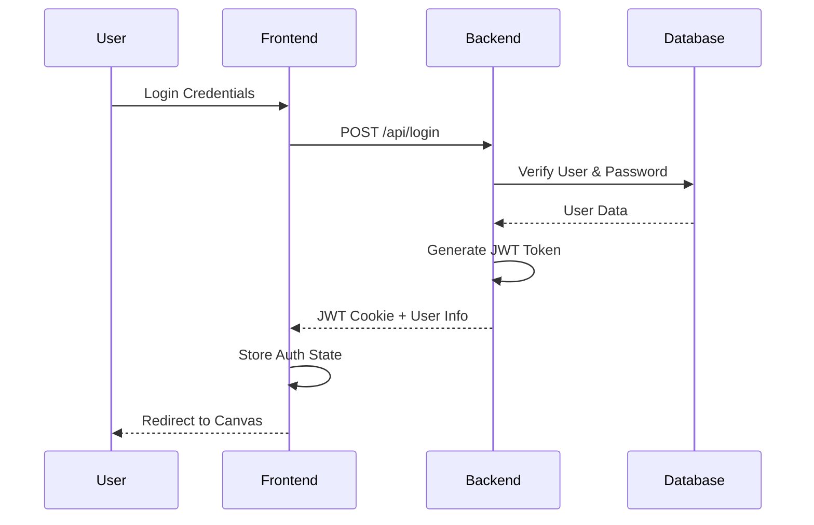
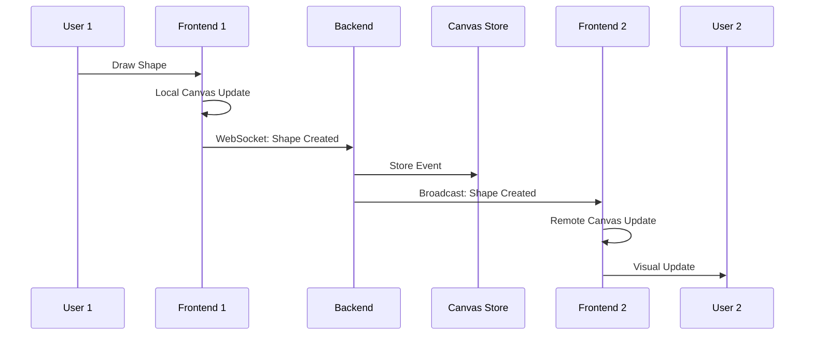
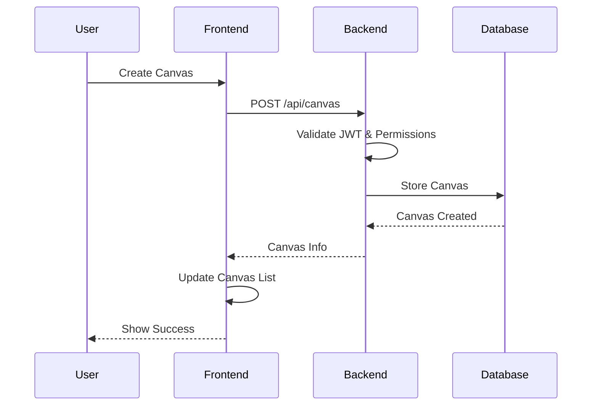

# Drawing App - Architektur Dokumentation

## Projekt Überblick

Das Drawing App Projekt ist eine moderne, vollständig funktionale Multi-User Canvas-Zeichenanwendung, die mit einer Rust-basierten Backend-API und einem TypeScript/JavaScript-Frontend entwickelt wurde. Die Anwendung ermöglicht es Benutzern, gemeinsam in Echtzeit auf geteilten Canvas-Flächen zu zeichnen, mit einem robusten Berechtigungssystem und persistenter Datenspeicherung.

## Architektur Überblick

### Technologie-Stack

#### Backend
- **Framework**: Axum (Rust Web Framework)
- **Runtime**: Tokio (Async Runtime)
- **Datenbank**: SQLite mit SQLx
- **WebSocket**: Tokio-Tungstenite
- **Authentifizierung**: JWT mit bcrypt
- **Logging**: Tracing

#### Frontend
- **SPA Framework**: Vanilla JavaScript Router
- **Canvas Engine**: TypeScript + HTML5 Canvas
- **Build System**: Node.js + TypeScript Compiler
- **WebSocket**: Native WebSocket API
- **Styling**: CSS3 mit Component-basiertem Ansatz
- **Module System**: ES6 Modules

## System Komponenten

### Zusätzliche Features über die Anforderungen hinaus

#### Administrative Features
- **Initial User System**: Automatische Erstellung von Admin- und Test-Benutzern aus `data/initial_users.json`
- **User Search & Pagination**: Erweiterte Benutzersuche für Permission-Management mit Pagination-Support

#### Performance & Caching
- **Hash-basierte Cache-Busting**: Automatisches Cache-Management mit `client-hash.json` für optimale Browser-Caching-Strategien
- **WebSocket Connection Cleanup**: Automatische Bereinigung inaktiver WebSocket-Verbindungen

#### Enhanced Canvas Features  
- **Unique Client-ID Generation**: Hash-basierte Client-Identifikation für kollisions-freie Shape-IDs
- **German Color Support**: Mehrsprachige Farbbezeichnungen (rot, grün, blau, etc.)
- **User Color Assignment**: Automatische Zuweisung eindeutiger Benutzerfarben für bessere Kollaboration

### 1. Backend Architektur

#### Core Module
- **main.rs**: Entry Point und HTTP-Router Konfiguration
- **auth.rs**: JWT-basierte Authentifizierung und Autorisierung
- **database.rs**: SQLite Datenbankschicht mit async Operations
- **websocket.rs**: WebSocket Handler für Multiuser-Kollaboration
- **canvas_store.rs**: In-Memory Event Store für Canvas-Events
- **events.rs**: Event Definitionen und -strukturen
- **file_utils.rs**: Static File Serving und SPA Routing

#### API Endpunkte
```
Authentication:
  POST /api/register      - Benutzer-Registrierung
  POST /api/login         - Benutzer-Anmeldung
  POST /api/logout        - Benutzer-Abmeldung
  GET  /api/validate-token - Token-Validierung
  GET  /api/user-info     - Benutzer-Informationen

Canvas Management:
  GET    /api/canvas      - Liste aller Canvas
  POST   /api/canvas      - Neue Canvas erstellen
  GET    /api/canvas/:id  - Canvas-Details
  PUT    /api/canvas/:id  - Canvas-Eigenschaften ändern
  DELETE /api/canvas/:id  - Canvas löschen

User Management:
  GET /api/users/search   - Benutzer-Suche (für Permission-Management)
  GET /api/users/list     - Paginierte Benutzer-Liste
  PUT /api/profile/display-name - Anzeigename ändern

WebSocket & Monitoring:
  GET /channel                     - WebSocket Canvas-Events
  GET /api/websocket/stats         - WebSocket-Statistiken
  GET /api/canvas/:canvas_id/users - Aktive Canvas-Nutzer
```

### 2. Frontend Architektur

#### Core Components
- **SPA Router** (app.js): Client-side Navigation und Template-Management
- **Canvas Engine** (drawer/): TypeScript-basierte Canvas-Operationen
- **WebSocket Client**: Echtzeit-Kommunikation mit Backend
- **State Management**: Color State, Drawer State, Event State
- **Component System**: Modulare UI-Komponenten

#### Canvas Engine Module
```typescript
// Core Canvas System
Canvas          // Canvas Management & Rendering
AbstractShape   // Base Shape Class
ShapeFactory    // Shape Creation Factory
Tools           // Drawing Tools (Line, Circle, Rectangle, Triangle)

// Event System
EventBus        // Publish/Subscribe Pattern
EventStore      // Local Event History (Undo/Redo)
EventWrapper    // Event Normalization

// WebSocket Integration
WebSocketClient          // Connection Management
CanvasWebSocketBridge    // Canvas <-> WebSocket Integration
```

## Datenfluss Architektur

### 1. Benutzer Authentifizierung



### 2. Canvas Kollaboration



### 3. Canvas Management



## Berechtigungssystem

### Permission Levels
- **O (Owner)**: Vollzugriff - kann alle Berechtigungen vergeben, Canvas löschen
- **M (Moderate)**: Moderations-Rechte - kann R/W/V Berechtigungen vergeben
- **V (Validate)**: Validierungs-Rechte - kann Moderations-Entscheidungen treffen
- **W (Write)**: Schreibzugriff - kann auf Canvas zeichnen
- **R (Read)**: Lesezugriff - kann Canvas nur anzeigen

### Permission Hierarchy
```
Owner (O)
├── Kann Canvas löschen
├── Kann alle Berechtigungen vergeben
└── Hat alle niedrigeren Rechte

Moderator (M)
├── Kann R/W/V Berechtigungen vergeben
├── Kann Benutzer moderieren
└── Hat alle niedrigeren Rechte

Validator (V)
├── Kann Moderations-Entscheidungen treffen
├── Kann problematische Inhalte markieren
└── Hat alle niedrigeren Rechte

Writer (W)
├── Kann Shapes erstellen/bearbeiten/löschen
├── Kann an Echtzeit-Kollaboration teilnehmen
└── Hat alle niedrigeren Rechte

Reader (R)
├── Kann Canvas anzeigen
├── Kann Canvas-Events empfangen
└── Basis-Berechtigung
```

## Event System

### Canvas Event Types
```typescript
interface CanvasEvent {
    id: string;
    type: 'shape_created' | 'shape_modified' | 'shape_deleted' | 'cursor_moved';
    canvas_id: string;
    user_id: string;
    data: any;
    timestamp: string;
    metadata?: any;
}
```

### Event Flow
1. **Local Action**: Benutzer-Interaktion auf Canvas
2. **Immediate Local Update**: Sofortige lokale Canvas-Aktualisierung
3. **Event Creation**: TypeScript Event-Objekt erstellen
4. **WebSocket Transmission**: Event an Server senden
5. **Server Processing**: Event validieren und im Store speichern
6. **Broadcasting**: Event an alle Canvas-Teilnehmer senden
7. **Remote Processing**: Event von anderen Clients verarbeiten

## Datenbank Schema

### Tabellen Struktur

#### users
```sql
CREATE TABLE users (
    id TEXT PRIMARY KEY,           -- UUID v4
    email TEXT UNIQUE NOT NULL,    -- Eindeutige E-Mail
    display_name TEXT NOT NULL,    -- Anzeigename
    password_hash TEXT NOT NULL,   -- bcrypt Hash
    created_at TIMESTAMP DEFAULT CURRENT_TIMESTAMP
);
```

#### canvas  
```sql
CREATE TABLE canvas (
    id TEXT PRIMARY KEY,           -- canvas-{UUID}
    name TEXT NOT NULL,            -- Canvas-Name
    owner_id TEXT NOT NULL,        -- Referenz zu users.id
    is_moderated BOOLEAN DEFAULT FALSE,  -- Moderations-Status
    created_at TIMESTAMP DEFAULT CURRENT_TIMESTAMP,
    FOREIGN KEY (owner_id) REFERENCES users (id)
);
```

#### canvas_permissions
```sql
CREATE TABLE canvas_permissions (
    canvas_id TEXT NOT NULL,       -- Referenz zu canvas.id
    user_id TEXT NOT NULL,         -- Referenz zu users.id
    permission TEXT NOT NULL,      -- R/W/V/M/O
    granted_at TIMESTAMP DEFAULT CURRENT_TIMESTAMP,
    PRIMARY KEY (canvas_id, user_id),
    FOREIGN KEY (canvas_id) REFERENCES canvas (id),
    FOREIGN KEY (user_id) REFERENCES users (id)
);
```

### Initial User Configuration

Das System unterstützt automatische Benutzer-Initialisierung über `data/initial_users.json`:

```json
{
  "users": [
    {
      "email": "admin@drawing-app.local",
      "display_name": "Administrator", 
      "password": "admin123",
      "is_admin": true
    },
    {
      "email": "user@drawing-app.local",
      "display_name": "Test User",
      "password": "user123",
      "is_admin": false
    },
    {
      "email": "moderator@drawing-app.local",
      "display_name": "Moderator",
      "password": "mod123",
      "is_admin": false
    },
    {
      "email": "demo@drawing-app.local",
      "display_name": "Demo Account",
      "password": "demo123",
      "is_admin": false
    },
    {
      "email": "guest@drawing-app.local",
      "display_name": "Guest User",
      "password": "guest123",
      "is_admin": false
    },
    {
      "email": "viewer@drawing-app.local",
      "display_name": "Viewer",
      "password": "view123",
      "is_admin": false
    }
  ]
}
```

Diese Initial-Accounts ermöglichen das Testen verschiedener Benutzerrollen und Permission-Levels ohne manuelle Registrierung. Die Canvas-spezifischen Berechtigungen müssen für jeden Canvas einzeln vergeben werden.

## WebSocket Protocol

### Connection Establishment
```javascript
// Client Side
const wsUrl = `ws://localhost:3000/channel?canvas_id=${canvasId}`;
const socket = new WebSocket(wsUrl);

// Server authenticates via JWT cookie
// Server validates canvas permissions
// Connection established for authorized users
```

### Message Format
```json
{
    "type": "canvas_event",
    "event_type": "shape_created",
    "canvas_id": "canvas-123",
    "user_id": "user-456",
    "data": {
        "shape_id": "shape-789",
        "shape_type": "line",
        "properties": {
            "start": {"x": 100, "y": 200},
            "end": {"x": 300, "y": 400},
            "color": "#FF0000",
            "strokeWidth": 2
        }
    },
    "timestamp": "2024-01-15T10:30:00Z"
}
```

## Build & Deployment

### Development Setup
```bash
# Prerequisites
curl --proto '=https' --tlsv1.2 -sSf https://sh.rustup.rs | sh
npm install

# Development Mode (Hot Reload)
npm run dev              # Beide: TypeScript Watch + Rust Watch
npm run dev-frontend     # Nur Frontend Watch
npm run dev-backend      # Nur Backend Watch

# Manual Build
npm run build            # Frontend Build (TypeScript -> JavaScript)
cargo build              # Backend Build (Rust -> Binary)

# Production
npm start               # Build + Server Start
cargo run --release     # Optimized Release Build
```

### Project Structure
```
a5/
├── src/backend/         # Rust Backend Code
├── src/drawer/          # TypeScript Canvas Engine
├── client/             # Frontend Assets & Templates
├── tests/              # Backend & Frontend Tests
├── data/               # SQLite Database & Initial Data
├── docs/               # Architecture Documentation
├── dest/               # Built Frontend Assets
├── target/             # Rust Build Artifacts
├── Cargo.toml          # Rust Dependencies
├── package.json        # Node.js Dependencies
└── tsconfig.json       # TypeScript Configuration
```

### Docker Deployment
```dockerfile
# Multi-stage Build
FROM rust:1.70 AS backend-builder
WORKDIR /app
COPY Cargo.toml Cargo.lock ./
COPY src/ src/
RUN cargo build --release

FROM node:18 AS frontend-builder
WORKDIR /app
COPY package*.json tsconfig.json ./
COPY src/ src/
COPY client/ client/
RUN npm install && npm run build

FROM debian:bullseye-slim
RUN apt-get update && apt-get install -y sqlite3 && rm -rf /var/lib/apt/lists/*
WORKDIR /app
COPY --from=backend-builder /app/target/release/drawing-app-backend ./
COPY --from=frontend-builder /app/dest/ ./dest/
COPY data/ ./data/
EXPOSE 3000
CMD ["./drawing-app-backend"]
```

## Security Considerations

### Authentication & Authorization
- **JWT Security**: HMAC-SHA256 signed tokens, HTTP-Only cookies
- **Password Security**: bcrypt hashing with salt rounds
- **Session Management**: Secure cookie attributes (HttpOnly, SameSite)
- **Permission Validation**: Server-side authorization für alle API-Calls

### Input Validation & Sanitization
- **API Input**: Serde-basierte strukturierte Validierung
- **SQL Injection Prevention**: SQLx prepared statements
- **WebSocket Security**: Message validation

### Network Security
- **WebSocket Security**: Sichere WebSocket-Verbindungen über HTTP

## Performance Optimierungen

### Backend Performance
- **Async Operations**: Vollständig non-blocking I/O mit Tokio
- **Connection Pooling**: SQLite Connection Pool
- **In-Memory Caching**: Canvas Events im RAM für schnellen Zugriff
- **WebSocket Optimierungen**: Selective Broadcasting, Connection Cleanup

### Frontend Performance
- **Template Caching**: In-Memory Template-Cache
- **Asset Optimization**: Hash-based Cache-Busting

### Database Performance
- **Indexing**: Optimale Indizes für häufige Queries
- **Query Optimization**: Effiziente SQL-Queries mit Joins
- **Pagination**: Limit/Offset für große Datenmengen
- **Prepared Statements**: SQL-Compilation-Caching

## Testing Strategy

**⚠️ HINWEIS: Die vorhandenen Tests sind unvollständig und vollkommen KI-generiert.**

### Backend Testing
- **Unit Tests**: Grundlegende Auth- und Database-Tests
- **Integration Tests**: API-Endpoint Testing mit tokio-test

### Frontend Testing
- **Unit Tests**: SPA Navigation und Routing
- **E2E Tests**: Grundlegende Auth-Workflows

## Debugging Tools
- **WebSocket Statistics**: `/api/websocket/stats` Endpoint
- **Canvas User Tracking**: Aktive Benutzer pro Canvas
- **Database Query Logging**: SQLx Query-Tracing
- **Frontend Debug Console**: Structured Client-side Logging


Dieses Dokument bietet einen umfassenden Überblick über die Architektur der Drawing App. Für detaillierte Informationen zu spezifischen Komponenten siehe die entsprechenden Dokumentationsdateien im `docs/` Verzeichnis.