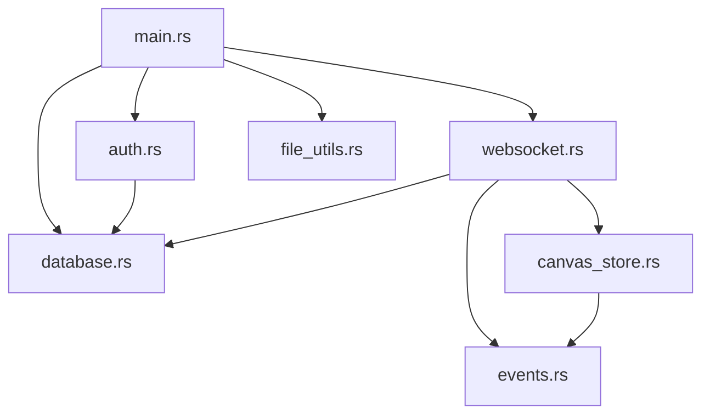

# Backend Module Dokumentation

## Module Übersicht

Das Backend besteht aus mehreren spezialisierten Modulen, die jeweils spezifische Funktionalitäten kapseln und eine klare Trennung der Verantwortlichkeiten gewährleisten.

## 1. Authentication Module (auth.rs)

### Zweck
Verwaltet die komplette Benutzerauthentifizierung und -autorisierung für die Anwendung.

### Hauptfunktionalitäten
- **JWT-Token Management**: Erstellen, validieren und dekodieren von JSON Web Tokens
- **Passwort-Sicherheit**: bcrypt-basierte Passwort-Hashierung
- **Cookie-Handling**: Sichere HTTP-Only Cookie-Verwaltung
- **Berechtigungsvalidierung**: Canvas-spezifische Berechtigungsprüfung

### Wichtige Strukturen
```rust
pub struct User {
    pub id: String,
    pub email: String,
    pub display_name: String,
    pub password_hash: String,
}

pub struct JwtClaims {
    pub user_id: String,
    pub email: String,
    pub display_name: String,
    pub canvas_permissions: HashMap<String, String>,
    pub exp: usize,
}
```

### Funktionen
- `create_jwt(user: &User) -> Result<String, AuthError>`
- `validate_jwt(token: &str) -> Result<JwtClaims, AuthError>`
- `create_auth_cookie(token: &str) -> String`
- `create_logout_cookie() -> String`

## 2. Database Module (database.rs)

### Zweck
Abstrahiert alle Datenbankoperationen und stellt eine typisierte Schnittstelle zur SQLite-Datenbank bereit.

### Hauptfunktionalitäten
- **User Management**: CRUD-Operationen für Benutzer
- **Canvas Management**: Canvas-Erstellung, -Update und -Löschung
- **Permission Management**: Granulare Berechtigungsverwaltung
- **Search Operations**: Benutzer- und Canvas-Suche

### Wichtige Strukturen
```rust
pub struct DatabaseManager {
    pool: SqlitePool,
}

pub struct DatabaseUser {
    pub id: String,
    pub email: String,
    pub display_name: String,
    pub password_hash: String,
    pub created_at: chrono::DateTime<chrono::Utc>,
}

pub struct DatabaseCanvas {
    pub id: String,
    pub name: String,
    pub owner_id: String,
    pub is_moderated: bool,
    pub created_at: chrono::DateTime<chrono::Utc>,
}
```

### Datenbankoperationen
- **User Operations**: `create_user()`, `get_user_by_email()`, `update_user_display_name()`
- **Canvas Operations**: `create_canvas()`, `list_user_canvas()`, `delete_canvas()`
- **Permission Operations**: `set_canvas_permission()`, `user_has_canvas_permission()`

## 3. WebSocket Module (websocket.rs)

### Zweck
Implementiert Echtzeit-Kommunikation für Multi-User Canvas-Kollaboration über WebSocket-Verbindungen.

### Hauptfunktionalitäten
- **Connection Management**: WebSocket-Verbindungen verwalten
- **Event Broadcasting**: Canvas-Events an alle verbundenen Clients senden
- **User Tracking**: Aktive Benutzer pro Canvas verfolgen
- **Cleanup Tasks**: Automatische Bereinigung inaktiver Verbindungen

### Wichtige Strukturen
```rust
pub struct WebSocketState {
    pub canvas_store: SharedCanvasStore,
    pub db: Arc<DatabaseManager>,
}

pub struct ClientConnection {
    pub user_id: String,
    pub canvas_id: String,
    pub sender: mpsc::UnboundedSender<Message>,
}
```

### WebSocket Events
- **Connection Events**: Benutzer-Beitritt und -Verlassen
- **Canvas Events**: Zeichnungs-Events zwischen Clients
- **System Events**: Verbindungsstatus und Statistiken

## 4. Event Store Module (canvas_store.rs)

### Zweck
Verwaltet Canvas-Events im Arbeitsspeicher für schnellen Zugriff und Event-Replay-Funktionalität.

### Hauptfunktionalitäten
- **Event Storage**: Speicherung von Canvas-Events im RAM
- **Event Retrieval**: Abrufen von Events für neue Clients
- **Thread Safety**: Concurrent-Access über Arc/RwLock
- **Memory Management**: Automatische Bereinigung alter Events

### Wichtige Strukturen
```rust
pub type SharedCanvasStore = Arc<RwLock<CanvasEventStore>>;

pub struct CanvasEventStore {
    pub canvas_events: HashMap<String, Vec<CanvasEvent>>,
    pub client_connections: HashMap<String, ClientConnection>,
}

pub struct CanvasEvent {
    pub id: String,
    pub canvas_id: String,
    pub user_id: String,
    pub event_type: String,
    pub event_data: Value,
    pub timestamp: chrono::DateTime<chrono::Utc>,
}
```

### Event Operations
- `add_event(canvas_id: &str, event: CanvasEvent)`
- `get_events(canvas_id: &str) -> Vec<CanvasEvent>`
- `clear_old_events(canvas_id: &str, max_age: Duration)`

## 5. Events Module (events.rs)

### Zweck
Definiert alle Event-Typen und -Strukturen für Canvas-Interaktionen.

### Event Kategorien

#### Shape Events
- **ShapeCreated**: Neue geometrische Form erstellt
- **ShapeModified**: Eigenschaften einer Form geändert  
- **ShapeDeleted**: Form von Canvas entfernt

#### User Events
- **UserJoined**: Benutzer Canvas beigetreten
- **UserLeft**: Benutzer Canvas verlassen
- **CursorMoved**: Cursor-Position aktualisiert

#### System Events
- **CanvasCleared**: Canvas vollständig geleert
- **PermissionChanged**: Benutzer-Berechtigung geändert

### Event Structure
```rust
pub enum DrawingEvent {
    ShapeCreated {
        shape_id: String,
        shape_type: String,
        properties: HashMap<String, Value>,
    },
    ShapeModified {
        shape_id: String,
        properties: HashMap<String, Value>,
    },
    ShapeDeleted {
        shape_id: String,
    },
}
```

## 6. File Utils Module (file_utils.rs)

### Zweck
Verwaltet das Serving von statischen Dateien und implementiert Single Page Application (SPA) Routing.

### Hauptfunktionalitäten
- **Static File Serving**: CSS, JS, HTML-Dateien ausliefern
- **SPA Routing**: Alle Routes zur index.html weiterleiten
- **Cache Management**: Hash-basierte Cache-Strategien
- **MIME Type Detection**: Automatische Content-Type-Bestimmung

### Wichtige Funktionen
- `handle_template_file(path: &str, cache_control: &str) -> Response<Body>`
- `get_client_hash() -> Result<String, std::io::Error>`
- `serve_static_with_hash(file_path: &str, hash: &str) -> Response<Body>`

### Caching Strategies
- **No-Cache**: Für dynamische Inhalte (`no-cache, must-revalidate`)
- **Long-Term**: Für Hash-versioned Assets (`max-age=31536000, immutable`)
- **Hash-Based**: URL-basierte Cache-Busting

## 7. Main Module (main.rs)

### Zweck
Entry Point der Anwendung, orchestriert alle anderen Module und konfiguriert den HTTP-Server.

### Hauptfunktionalitäten
- **Server Initialization**: Tokio-Runtime und Axum-Server starten
- **Routing Configuration**: Alle HTTP-Routes definieren
- **Middleware Setup**: Logging, Tracing, Error-Handling
- **State Management**: Globalen Application-State verwalten

### Application State
```rust
#[derive(Clone)]
pub struct AppState {
    pub db: Arc<DatabaseManager>,
    pub canvas_store: SharedCanvasStore,
}
```

### Route Groups
- **API Routes**: REST-API für Frontend-Kommunikation
- **WebSocket Routes**: Real-Time Communication
- **Static Routes**: File Serving und SPA Support
- **Authentication Routes**: Login/Register/Logout

## Modul-Abhängigkeiten



### Dependency Flow
1. **main.rs** orchestriert alle anderen Module
2. **database.rs** wird von auth.rs und websocket.rs verwendet
3. **canvas_store.rs** und **events.rs** werden von websocket.rs verwendet
4. **file_utils.rs** ist unabhängig und wird nur von main.rs verwendet

## Error Handling

### Error Types
Jedes Modul definiert seine eigenen Error-Types für typisierte Fehlerbehandlung:

```rust
// auth.rs
pub enum AuthError {
    InvalidCredentials,
    TokenExpired,
    DatabaseError(String),
}

// database.rs  
pub enum DatabaseError {
    ConnectionFailed,
    QueryFailed(String),
    UserNotFound,
}
```

### Error Propagation
- Module-spezifische Errors werden an der HTTP-Layer in StatusCodes konvertiert
- Strukturiertes Logging für alle Error-Cases
- Graceful Error Recovery wo möglich

## 8. Canvas Permission System Implementation

### Zweck
Implementiert ein granulares, hierarchisches Berechtigungssystem für Multi-User Canvas-Zugriff.

### Permission Hierarchie Logic
```rust
pub enum CanvasPermission {
    Owner = 5,     // O - Vollzugriff, kann alle Berechtigungen vergeben
    Moderator = 4, // M - Kann R/W/V Berechtigungen vergeben
    Validator = 3, // V - Kann Moderations-Entscheidungen treffen
    Writer = 2,    // W - Kann zeichnen und lesen
    Reader = 1,    // R - Kann nur lesen
}
```

### Permission Validation
- **Hierarchical Checks**: Höhere Permissions beinhalten niedrigere automatisch
- **Canvas-Specific**: Berechtigungen sind Canvas-spezifisch, nicht global
- **Database Integration**: Permissions werden in `canvas_permissions` Tabelle persistiert

### Moderations-Workflow
1. **Moderated Canvas**: `is_moderated = true` erfordert V+ Permission für Inhalts-Genehmigung
2. **Approval Process**: Neue Shapes werden zunächst als "pending" markiert
3. **Validator Decision**: V+ User können Shapes genehmigen/ablehnen

## 9. Event Sourcing Architecture Details

### Zweck
Implementiert vollständiges Event Sourcing für Canvas-State-Management mit Event-Replay-Funktionalität.

### Event Replay Mechanism
```rust
impl CanvasEventStore {
    pub async fn register_client(&self, canvas_id: String, user_id: String, 
                                display_name: String, client_id: String,
                                tx: mpsc::UnboundedSender<ServerMessage>) -> Result<Vec<CanvasEvent>, String> {
        // 1. Client zur Canvas registrieren
        // 2. Alle existierenden Events für Replay zurückgeben
        // 3. UserJoined Event an andere Clients senden
    }
}
```

### Event Persistierung Strategy
- **In-Memory Primary**: Events werden zunächst im RAM gespeichert für schnellen Zugriff
- **Database Backup**: Kritische Events können optional in Datenbank persistiert werden
- **Event Lifecycle**: Alte Events werden nach konfigurierbarer Zeit bereinigt

### Event Ordering & Konfliktauflösung
- **Timestamp-Based**: Events werden nach `timestamp` sortiert
- **Client-ID Tiebreaker**: Bei gleichen Timestamps wird `client_id` verwendet
- **Shape-Level Locking**: Concurrent Shape-Modifications werden durch Selection-System verhindert

## 10. WebSocket Real-Time Communication Details

### Zweck
Implementiert robuste Echtzeit-Kommunikation mit Heartbeat-Protokoll und automatischem Connection-Management.

### Heartbeat/Ping-Pong Protocol
```rust
// Client sendet Ping mit Timestamp
{"type": "ping", "timestamp": 1634567890123}

// Server antwortet mit Pong
{"type": "pong", "timestamp": 1634567890123}
```

### Client Connection Lifecycle
1. **WebSocket Upgrade**: JWT-Authentication in `websocket_handler()`
2. **Client Registration**: Eindeutige `client_id` generiert basierend auf User-Email + UUID
3. **Canvas Subscription**: Client registriert sich für spezifische Canvas
4. **Active Communication**: Bidirektionale Event-Übertragung
5. **Graceful Cleanup**: Automatic Unregistration bei Connection-Close

### Message Queue & Broadcasting Logic
```rust
impl CanvasEventStore {
    pub async fn add_event(&self, canvas_id: String, event: CanvasEvent, 
                          user_id: String, client_id: String) -> Result<(), String> {
        // 1. Event im Store speichern
        // 2. Event an alle registrierten Clients der Canvas broadcasten
        // 3. Sender-Client ausschließen (no echo-back)
    }
}
```

## 11. Canvas Store Memory Management

### Zweck
Effiziente In-Memory-Verwaltung von Canvas-Events mit automatischem Memory-Management.

### User Color Assignment Algorithm
```rust
fn assign_user_color(user_id: &str, canvas_users: &HashMap<String, UserInfo>) -> String {
    const COLORS: [&str; 8] = ["#FF6B6B", "#4ECDC4", "#45B7D1", "#96CEB4", 
                               "#FFEAA7", "#DDA0DD", "#98D8C8", "#F7DC6F"];
    
    // Konsistente Farbzuweisung basierend auf User-Hash
    let mut hasher = DefaultHasher::new();
    user_id.hash(&mut hasher);
    let color_index = (hasher.finish() as usize) % COLORS.len();
    
    // Kollisionsvermeidung: Falls Farbe bereits vergeben, nächste verfügbare wählen
    let used_colors: HashSet<_> = canvas_users.values().map(|u| &u.color).collect();
    for i in 0..COLORS.len() {
        let color = COLORS[(color_index + i) % COLORS.len()];
        if !used_colors.contains(color) {
            return color.to_string();
        }
    }
    COLORS[color_index].to_string() // Fallback
}
```

### Connection Cleanup Strategies
- **Heartbeat Timeout**: Connections ohne Ping für >60 Sekunden werden als tot markiert
- **Periodic Cleanup**: Background-Task alle 30 Sekunden für Stale-Connection-Removal
- **Graceful Shutdown**: Ordnungsgemäße Unregistration bei WebSocket-Close

### Memory Optimization für große Canvas
- **Event Pagination**: Nur letzte N Events werden im Memory gehalten
- **Compression**: Ähnliche aufeinanderfolgende Events werden zusammengefasst
- **Canvas Archivierung**: Inaktive Canvas werden aus Memory entfernt

## 12. JWT Token & Security Implementation Details

### Zweck
Sichere JWT-basierte Authentifizierung mit Canvas-Permission-Integration.

### JWT Claims Structure
```rust
#[derive(Debug, Serialize, Deserialize)]
pub struct Claims {
    pub user_id: String,
    pub email: String,
    pub display_name: String,
    pub canvas_permissions: HashMap<String, String>, // canvas_id -> permission_level
    pub exp: usize, // Expiration timestamp
}
```

### Token Refresh Mechanism
- **Short-Lived Tokens**: 24 Stunden Gültigkeit für Security
- **Automatic Refresh**: Frontend refreshed Token automatisch bei API-Calls
- **Secure Storage**: HTTP-Only Cookies gegen XSS-Attacks

### Canvas Permission Claims Integration
- **Dynamic Claims**: Canvas-Permissions werden bei jeder Token-Generierung aus DB geladen
- **Permission Caching**: Permissions werden im Token gecached für Performance
- **Real-Time Updates**: Bei Permission-Änderungen muss Client neuen Token holen

## 13. Advanced API Endpoints Details

### Canvas User Management API
```rust
// GET /api/canvas/:canvas_id/users
pub async fn canvas_users_handler(
    Path(canvas_id): Path<String>,
    State(state): State<WebSocketState>,
    cookie_jar: CookieJar,
) -> Result<Json<Value>, StatusCode>
```

**Response Format:**
```json
{
  "canvas_id": "canvas-123",
  "users": [
    {
      "user_id": "user-456", 
      "display_name": "John Doe",
      "color": "#FF6B6B",
      "status": "active",
      "connected_at": "2023-10-15T14:30:00Z"
    }
  ]
}
```

### WebSocket Statistics API
```rust
// GET /api/websocket/stats  
pub async fn websocket_stats_handler(
    State(state): State<WebSocketState>,
) -> Result<Json<Value>, StatusCode>
```

**Metrics Collected:**
- `total_canvases`: Anzahl Canvas mit aktiven Connections
- `total_events`: Gesamtanzahl Events im Memory Store
- `active_canvases`: Anzahl Canvas mit >0 verbundenen Clients
- `total_connections`: Anzahl aktive WebSocket-Connections
- `average_events_per_canvas`: Durchschnittliche Event-Anzahl pro Canvas
- `average_connections_per_canvas`: Durchschnittliche Verbindungen pro Canvas

## 14. Error Handling & Recovery Details

### Structured Error Types per Module
```rust
// auth.rs
#[derive(Debug, thiserror::Error)]
pub enum AuthError {
    #[error("Invalid credentials provided")]
    InvalidCredentials,
    #[error("JWT token has expired")]
    TokenExpired,
    #[error("Database operation failed: {0}")]
    DatabaseError(String),
    #[error("User not found")]
    UserNotFound,
}

// database.rs
#[derive(Debug, thiserror::Error)]
pub enum DatabaseError {
    #[error("Failed to connect to database")]
    ConnectionFailed,
    #[error("SQL query failed: {0}")]
    QueryFailed(String),
    #[error("User with email {email} not found")]
    UserNotFound { email: String },
    #[error("Canvas with id {canvas_id} not found")]
    CanvasNotFound { canvas_id: String },
}

// websocket.rs
#[derive(Debug, thiserror::Error)]
pub enum WebSocketError {
    #[error("Client {client_id} not registered for canvas {canvas_id}")]
    ClientNotRegistered { client_id: String, canvas_id: String },
    #[error("Failed to send message to client {client_id}")]
    MessageSendFailed { client_id: String },
    #[error("WebSocket connection closed unexpectedly")]
    ConnectionClosed,
}
```

### Error Propagation Chains
1. **Module-Level**: Spezifische Error-Types für jede Funktionalität
2. **API-Level**: Conversion zu HTTP StatusCodes in Handler-Funktionen
3. **Client-Level**: Strukturierte JSON-Error-Responses
4. **Logging**: Alle Errors werden mit Context geloggt für Debugging

### Graceful Degradation Strategies
- **Database Offline**: Canvas-Events bleiben im Memory verfügbar
- **WebSocket Errors**: Client kann per HTTP-Polling fallback
- **Memory Pressure**: Automatische Event-Cleanup bei Low-Memory
- **Canvas Overload**: Request-Rate-Limiting für einzelne Canvas

## 15. Multi-User Collaboration Features

### User Presence Tracking
```rust
pub struct UserInfo {
    pub user_id: String,
    pub display_name: String,
    pub color: String,
    pub connected_at: DateTime<Utc>,
    pub last_activity: DateTime<Utc>,
    pub selected_shapes: Vec<String>, // Currently selected shape IDs
}
```

### Concurrent Shape Selection Prevention
- **Selection Locking**: Shapes können nur von einem User gleichzeitig selektiert werden
- **Selection Events**: `selectShape` und `unselectShape` Events informieren andere Clients
- **Visual Feedback**: Selektierte Shapes werden in User-Color hervorgehoben
- **Automatic Release**: Selection wird automatisch freigegeben bei Client-Disconnect

### Real-Time User Cursor Tracking
- **Cursor Events**: `cursorMoved` Events mit X/Y-Koordinaten
- **Throttling**: Cursor-Events werden auf 10fps begrenzt für Performance
- **Privacy**: Cursor wird nur angezeigt wenn User aktiv zeichnet
- **Cleanup**: Cursor verschwindet nach 5 Sekunden Inaktivität

## 16. Performance & Scaling Considerations

### WebSocket Connection Limits
```rust
const MAX_CONNECTIONS_PER_CANVAS: usize = 50;
const MAX_TOTAL_CONNECTIONS: usize = 1000;
const CONNECTION_TIMEOUT: Duration = Duration::from_secs(60);
```

### Event Store Memory Limits
```rust
const MAX_EVENTS_PER_CANVAS: usize = 10000;
const MAX_EVENT_AGE: Duration = Duration::from_hours(24);
const CLEANUP_INTERVAL: Duration = Duration::from_secs(300); // 5 minutes
```

### Database Connection Pooling Configuration
```rust
let db_pool = SqlitePoolOptions::new()
    .max_connections(20)
    .min_connections(5)
    .connect_timeout(Duration::from_secs(30))
    .idle_timeout(Duration::from_secs(600))
    .connect(&database_url)
    .await?;
```

### Scaling Strategies
- **Horizontal Scaling**: Multiple Backend-Instanzen mit Shared Database
- **Canvas Sharding**: Canvas können auf verschiedene Server-Instanzen verteilt werden
- **Redis Integration**: Für Session-Storage und Cross-Instance Event-Broadcasting
- **Load Balancing**: WebSocket Sticky-Sessions für Connection-Konsistenz

## Testing Strategy

**⚠️ HINWEIS: Die beschriebenen Tests sind unvollständig und vollkommen KI-generiert. Sie existieren nur teilweise oder gar nicht in der aktuellen Implementierung.**

### Unit Tests
- **Grundlegende Tests**: Für Auth- und Database-Module
- **Async Support**: Mit tokio-test Integration

### Integration Tests  
- **API Testing**: Grundlegende Endpoint-Tests
- **Database Testing**: Mit Test-Database

### Tatsächliche Test-Struktur
```
tests/
├── auth_unit.rs
├── auth_integration.rs
├── backend_unit_tests.rs
└── backend_integration_tests.rs
```